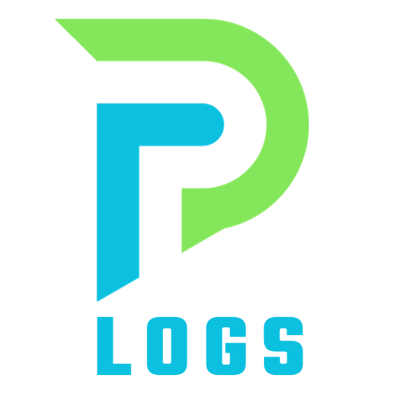

<h2 align="center">
  <p align="center"></p>
</h2>

# Pod Logs (plogs)
`plogs` is a kubernetes plugin that facilitates retrieving logs from Kubernetes pods with various filtering and highlighting options. It allows users to specify the namespace, container name, labels, and mark specific words for highlighting within the logs.

## Installation

### Linux

```bash
# DEB
export PLOGS_VERSION="0.1.1"
wget -q https://github.com/kha7iq/ncp/releases/download/v${PLOGS_VERSION}/plogs_amd64.deb
sudo dpkg -i ncp_amd64.deb
# RPM
sudo rpm -i plogs_amd64.rpm
```
- Bash Install Script

  By default, plogs is going to be installed at `/usr/bin/`. Sudo privileges are required for this operation.

  If you would like to provide a custom install path, you can do so as an input to the script. 
  For example, you can run `./install.sh $HOME/bin` to install plogs in the specified directory.

```bash
curl -sL https://bit.ly/installplogs | sudo sh
```
OR
```bash
curl -s https://raw.githubusercontent.com/kha7iq/plogs/main/install.sh | sudo sh
```

<details>
    <summary>Manual</summary>

```bash
# Chose desired version
export PLOGS_VERSION="0.1.1"
wget -q https://github.com/kha7iq/ncp/releases/download/v${PLOGS_VERSION}/plogs_linux_amd64.tar.gz && \
tar -xf plogs_linux_amd64.tar.gz && \
chmod +x plogs && \
sudo mv plogs /usr/local/bin/kubectl-plogs
```
</details>


### Flags

- `-m, --mark [string]`: Mark the given word or sentence in logs.
- `-n, --namespace [string]`: Specify the Kubernetes namespace.
- `-c, --containerName [string]`: Specify the container name within the pod.
- `-l, --label [string]`: Specify labels to match.
- `-p, --pod [string]`: Specify the pod name.
- `-f, --follow`: Specify to follow logs.
- `-t, --tail [int]`: Specify the number of lines from the end of the logs to show.


#### Get logs with highlighting
```bash
kubectl plogs --namespace=default --label=app=myapp --mark=error --pod=my-pod --follow --tail=100
```
#### Get logs without specifying a container name

```bash
kubectl plogs --namespace=default --pod=my-pod --follow --tail=100
```

### Prerequisites
- Kubernetes cluster access or kubeconfig set up

## Issues
If you encounter any problems or have suggestions for improvements, please [open an issue](https://github.com/kha7iq/plogs/issues) on GitHub.

### License
plogs is licensed under the MIT License. 